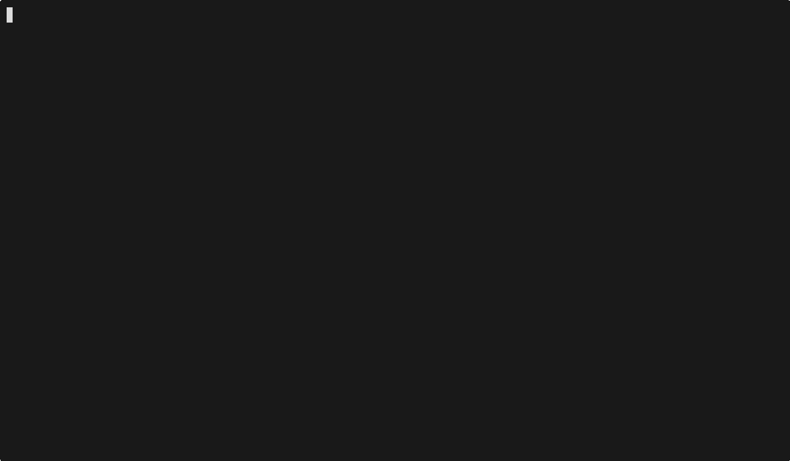

# nvim-docker

[](https://github.com/pandamy619/nvim-docker/actions/workflows/ci.yml)
[](https://github.com/pandamy619/nvim-docker/actions/workflows/release-check.yml)
[](https://github.com/pandamy619/nvim-docker/pkgs/container/nvim-docker)

[Русский](README.ru.md)

Portable Neovim in Docker with an opinionated Lua config, profile-based images, and a launcher that opens any project inside an isolated editor container.



## Who This Is For

- Developers who want a reproducible Neovim setup without installing local LSPs and toolchains.
- Teams onboarding people onto mixed-language repositories.
- People moving between machines who want the same editor behavior everywhere.

## What You Get

- Lua-based Neovim config
- `lazy.nvim` plugin management
- Treesitter highlighting and parsing
- `nvim-lspconfig` + `nvim-cmp`
- `neo-tree.nvim`, `gitsigns.nvim`, `neogit`
- Go support through `go.nvim`, `gopls`, and `goimports`
- Profile-based images: `base`, `go`, `web`, `full`

## Image Profiles

| Profile | Includes | Local target | GHCR tag |
| :--- | :--- | :--- | :--- |
| `base` | `nvim`, `git`, `ripgrep`, embedded config | `base` | `latest-base` |
| `go` | `base` + Go toolchain, `gopls`, `goimports` | `go` | `latest-go` |
| `web` | `base` + Node runtime, `pyright`, TypeScript/CSS language servers | `web` | `latest-web` |
| `full` | `go` + `web` + LuaLS + `rust-analyzer` + Python CLI tools | `full` | `latest` |

## Profile Comparison

Approximate values below are expectations based on the current Dockerfile composition. Actual numbers depend on host performance, network speed, and whether plugin caches are already warm.

| Profile | Best for | Approx. image size | Approx. first open | Notes |
| :--- | :--- | :--- | :--- | :--- |
| `base` | minimal editing and generic repos | `0.4-0.6 GB` | `20-40 sec` | smallest image, no language-specific runtimes |
| `go` | Go-heavy repositories | `0.7-0.9 GB` | `30-60 sec` | includes `go`, `gopls`, and `goimports` |
| `web` | TypeScript, CSS, and Python-adjacent repos | `0.6-0.8 GB` | `30-60 sec` | includes `node`, `pyright`, and TypeScript/CSS language servers |
| `full` | mixed-language repos and default Codespaces usage | `1.3-1.5 GB` | `45-90 sec` | largest image, broadest built-in tooling |

## Supported Hosts

- macOS with Docker Desktop
- Linux with Docker Engine
- `amd64` and `arm64` container builds

## 30-Second Start

- Local launcher: run `./devcontainer-conf/nv.sh`
- VS Code / Codespaces: the default [`.devcontainer/devcontainer.json`](.devcontainer/devcontainer.json) opens the `full` profile
- Alternative profiles: choose `.devcontainer/base`, `.devcontainer/go`, `.devcontainer/web`, or `.devcontainer/full`
- Prebuilt image: run `NVIM_DOCKER_IMAGE=ghcr.io/pandamy619/nvim-docker:latest ./devcontainer-conf/nv.sh`

## Dev Containers and Codespaces

This repo ships one default devcontainer and four profile-specific alternatives:

- `.devcontainer/devcontainer.json` defaulting to `full`
- `.devcontainer/base/devcontainer.json`
- `.devcontainer/go/devcontainer.json`
- `.devcontainer/web/devcontainer.json`
- `.devcontainer/full/devcontainer.json`

In VS Code, use `Dev Containers: Reopen in Container` and pick the profile you want.

In GitHub Codespaces, the same profiles are available when creating a codespace.

Each profile runs a small `onCreateCommand` that performs `Lazy sync` once. That makes the setup compatible with Codespaces prebuilds.
Each profile also sets `overrideCommand: true`, so Dev Containers keeps the workspace container alive instead of exiting after the image `CMD`.

Prebuild note:
- GitHub Codespaces prebuilds are enabled in repository settings, not through a tracked repository file.
- The repository is prepared for prebuilds and the default recommendation is `.devcontainer/devcontainer.json`.
- See [docs/CODESPACES_PREBUILD.md](docs/CODESPACES_PREBUILD.md) for the exact manual enablement steps.

## Quick Start

```bash
git clone git@github.com:pandamy619/nvim-docker.git
cd nvim-docker
./devcontainer-conf/nv.sh
```

By default the launcher opens the current directory inside the container.

To open a different project:

```bash
./devcontainer-conf/nv.sh /path/to/project
```

To force an image rebuild:

```bash
./devcontainer-conf/nv.sh --rebuild /path/to/project
```

To build and run a specific local profile:

```bash
NVIM_DOCKER_TARGET=go ./devcontainer-conf/nv.sh /path/to/project
```

The launcher stores plugins, editor state, and caches in local ignored directories under `devcontainer-conf/local` and `devcontainer-conf/cache`.

To run the launcher against a prebuilt GHCR image instead of a local build:

```bash
NVIM_DOCKER_IMAGE=ghcr.io/pandamy619/nvim-docker:latest-go ./devcontainer-conf/nv.sh /path/to/project
```

## One-Command GHCR Run

Once a tagged release is published to GHCR, you can run the image directly without cloning the repo config:

```bash
docker run --rm -it \
  -v "$PWD:/home/dev/project" \
  -v nvim-docker-share:/home/dev/.local/share \
  -v nvim-docker-state:/home/dev/.local/state \
  -v nvim-docker-cache:/home/dev/.cache \
  ghcr.io/pandamy619/nvim-docker:latest \
  nvim /home/dev/project
```

The image already contains the Neovim config. The first run still needs network access to fetch plugins.

Available GHCR tags:

- `ghcr.io/pandamy619/nvim-docker:latest`
- `ghcr.io/pandamy619/nvim-docker:latest-base`
- `ghcr.io/pandamy619/nvim-docker:latest-go`
- `ghcr.io/pandamy619/nvim-docker:latest-web`

## Included Keymaps

### General

| Key | Action |
| :--- | :--- |
| `Space` | Leader key |
| `<leader>w` | Save file |
| `<leader>q` | Quit Neovim |

### Navigation

| Key | Action |
| :--- | :--- |
| `Ctrl + h/j/k/l` | Move between windows |

### Plugins and Git

| Key | Action |
| :--- | :--- |
| `<leader>e` | Toggle `neo-tree` |
| `<leader>gg` | Open `Neogit` |
| `]c` | Next hunk |
| `[c` | Previous hunk |
| `<leader>hs` | Stage hunk |
| `<leader>hr` | Reset hunk |
| `<leader>gb` | Show line blame |

### Completion

| Key | Action |
| :--- | :--- |
| `Ctrl + j/k` | Navigate completion items |
| `Enter` | Confirm selected item |

### LSP

| Key | Action |
| :--- | :--- |
| `gd` | Go to definition |
| `K` | Hover documentation |
| `gi` | Go to implementation |
| `<leader>rn` | Rename symbol |
| `<leader>ca` | Code actions |

### Go

| Key | Action |
| :--- | :--- |
| `<leader>gt` | Run current function test |
| `<leader>gf` | Run file tests |
| `<leader>gr` | Run `go run` |

## What Is Supported

- Portable editor startup through [`devcontainer-conf/nv.sh`](devcontainer-conf/nv.sh)
- Reproducible Docker build through [`devcontainer-conf/Dockerfile`](devcontainer-conf/Dockerfile)
- Multiple `.devcontainer` profiles for VS Code Dev Containers and GitHub Codespaces
- Pinned official Neovim release binaries inside the image
- Embedded fallback config inside the image for direct GHCR runs
- Local overrides through bind-mounted config when using the launcher

## What Is Not Included

- Project-specific compilers, SDKs, or databases beyond the bundled editor tooling
- Windows-native support
- A full project dev environment with app-specific services bundled
- Offline first-run plugin installation

## Release Notes

- See [CHANGELOG.md](CHANGELOG.md) for tagged changes.
- CI validates the repository and runs real devcontainer smoke tests for the default profile plus all profile-specific alternatives.
- Tagged releases publish multi-arch `amd64` and `arm64` images to `ghcr.io/pandamy619/nvim-docker`.
- Tagged releases publish `ghcr.io/pandamy619/nvim-docker` with `latest`, `latest-base`, `latest-go`, and `latest-web`.
